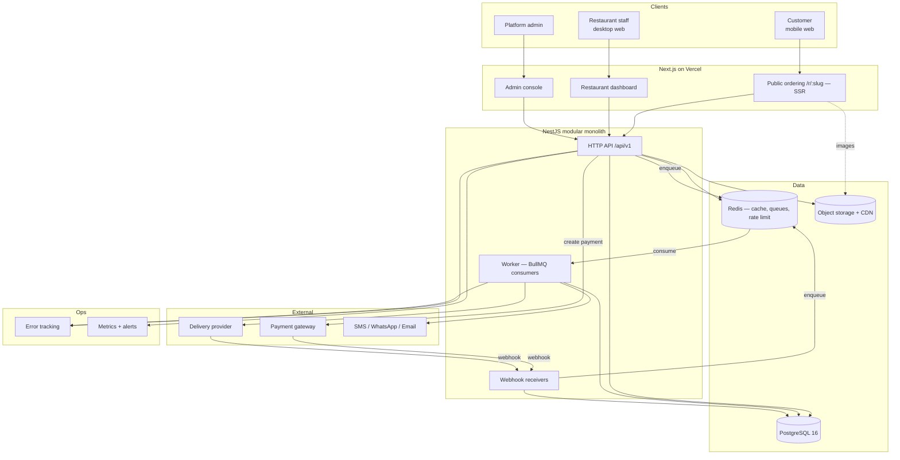

# Direct-Order — Implementation Handoff

**Prepared by:** Principal Architect (Opus)
**Intended reader:** The implementing Claude Sonnet agent
**Status:** Specification. No application code exists yet.
**Source of truth:** This document set supersedes the original 30 requirement prompts. You should not need to re-read them.

---

## How to use this handoff

Read this file completely, then read [docs/13-implementation-phases.md](docs/13-implementation-phases.md) before writing any code.

| #   | Section                            | Document                                                                     |
| --- | ---------------------------------- | ---------------------------------------------------------------------------- |
| —   | Prompt coverage map (verification) | [docs/00-prompt-coverage.md](docs/00-prompt-coverage.md)                     |
| 1   | Executive Summary                  | this file                                                                    |
| 2   | Product Scope                      | this file                                                                    |
| 3   | Architecture                       | this file                                                                    |
| 4   | Technology Stack                   | this file                                                                    |
| 5   | Domain Model                       | [docs/01-domain-model.md](docs/01-domain-model.md)                           |
| 6   | Database Schema                    | [docs/02-database-schema.md](docs/02-database-schema.md)                     |
| 7   | State Machines                     | [docs/03-state-machines.md](docs/03-state-machines.md)                       |
| 8   | API Specification                  | [docs/04-api-specification.md](docs/04-api-specification.md)                 |
| 9   | Authorization Matrix               | [docs/05-authorization-matrix.md](docs/05-authorization-matrix.md)           |
| 10  | Business Rules                     | [docs/06-business-rules.md](docs/06-business-rules.md)                       |
| 11  | Event Architecture                 | [docs/07-events-and-jobs.md](docs/07-events-and-jobs.md)                     |
| 12  | Background Jobs                    | [docs/07-events-and-jobs.md](docs/07-events-and-jobs.md)                     |
| 13  | Search                             | [docs/08-search-and-notifications.md](docs/08-search-and-notifications.md)   |
| 14  | Notifications                      | [docs/08-search-and-notifications.md](docs/08-search-and-notifications.md)   |
| 15  | Security                           | [docs/09-security.md](docs/09-security.md)                                   |
| 16  | Infrastructure                     | [docs/10-infrastructure-deployment.md](docs/10-infrastructure-deployment.md) |
| 17  | Deployment                         | [docs/10-infrastructure-deployment.md](docs/10-infrastructure-deployment.md) |
| 18  | Testing Strategy                   | [docs/11-testing-strategy.md](docs/11-testing-strategy.md)                   |
| 19  | Repository Structure               | [docs/12-repository-structure.md](docs/12-repository-structure.md)           |
| 20  | Implementation Phases              | [docs/13-implementation-phases.md](docs/13-implementation-phases.md)         |
| 21  | Acceptance Criteria                | [docs/14-acceptance-criteria.md](docs/14-acceptance-criteria.md)             |
| 22  | Ambiguities                        | [docs/15-ambiguities-and-risks.md](docs/15-ambiguities-and-risks.md)         |
| 23  | Risk Register                      | [docs/15-ambiguities-and-risks.md](docs/15-ambiguities-and-risks.md)         |
| 24  | Sonnet Execution Protocol          | [docs/16-execution-protocol.md](docs/16-execution-protocol.md)               |
| 25  | Definition of Done                 | [docs/16-execution-protocol.md](docs/16-execution-protocol.md)               |

---

## 1. Executive Summary

Direct-Order is a **commission-free direct-ordering platform for independent Indian restaurants**, starting in Bengaluru.

Restaurants in India lose 25–35% of order value to delivery aggregators through commissions, platform fees, and deductions they often did not consent to. Many are leaving those platforms and taking orders by phone and WhatsApp instead — which works, but does not scale and looks unprofessional.

Direct-Order gives each restaurant a **branded ordering link** (`/r/<slug>`) carrying its own menu, cart, checkout, and online payment; routes each order to a **restaurant dashboard** for fulfilment; dispatches delivery through an **on-demand third-party fleet**; and shows the restaurant a **transparent, itemised breakdown of every rupee**. The restaurant keeps its customer relationship and roughly 95%+ of order value.

**What makes this project harder than a typical CRUD app**, and where you must be most careful:

1. **Real money.** Every total is computed server-side in integer paise. Payment success is only ever established by provider-verified server-side confirmation — never by a frontend callback.
2. **Multi-tenancy.** Each restaurant is a tenant. Cross-tenant leakage is the single highest-severity class of bug in this system.
3. **Untrusted external events.** Payment and delivery webhooks arrive duplicated, delayed, and out of order. Every one must be signature-verified and processed idempotently.
4. **Concurrency on scarce resources.** Coupon usage limits, loyalty balances, referral rewards, and order state transitions all have real race conditions with financial consequences.

### Non-negotiable invariants

These hold everywhere in the codebase. A change that violates one of these is a defect regardless of what else it accomplishes.

| #      | Invariant                                                                                                                                                      |
| ------ | -------------------------------------------------------------------------------------------------------------------------------------------------------------- |
| INV-1  | Money is stored and computed as **BIGINT minor units (paise)**. Floating-point arithmetic on money is forbidden.                                               |
| INV-2  | The **payable amount is computed server-side** from database state. A client-supplied price, discount, or total is never authoritative.                        |
| INV-3  | An order is **PAID only after provider-verified confirmation** (webhook signature verification or server-to-server fetch).                                     |
| INV-4  | Every retryable financial operation is **idempotent**, enforced by a database constraint — not by an application-level existence check.                        |
| INV-5  | Authorization is derived from the **authenticated principal and server-side relationships**, never from a client-supplied `restaurantId`, `userId`, or `role`. |
| INV-6  | `refunded_total <= captured_total` for every payment, enforced in the database.                                                                                |
| INV-7  | `discount_total <= eligible_subtotal` and `payable_total >= 0` for every order.                                                                                |
| INV-8  | **Order line items are immutable snapshots.** Historical orders never change when a menu, price, or promotion changes later.                                   |
| INV-9  | Every state transition of an order, payment, refund, or delivery writes an **audit record**. Audit records are append-only.                                    |
| INV-10 | Notification, analytics, and loyalty failures **never roll back** a committed order or payment.                                                                |

---

## 2. Product Scope

### In scope

Customer ordering (guest-first), restaurant onboarding and dashboard, menu management, cart, checkout, pricing engine, payments, refunds, order lifecycle, delivery dispatch via provider abstraction, notifications and notification centre, customer support cases, promotions and coupons, ratings and reviews, loyalty, referrals, analytics, admin/platform operations, security, observability, backups and disaster recovery.

### Out of scope

- **Layer 2 consumer discovery marketplace** as a launched product. Cross-restaurant search is _implemented but feature-flagged off_ — see AMB-1.
- Native mobile apps. Web only, mobile-first.
- Own rider fleet. Delivery is always third-party.
- ONDC seller-side integration.
- Multi-restaurant cart. A cart belongs to exactly one restaurant.
- Advertising, sponsored placement, or paid ranking.
- Machine-learning ranking or recommendation.

### Launch sequencing

The source product documents target a fast single-restaurant pilot; the full requirement set describes a mature multi-tenant platform. These are reconciled by phasing:

- **Pilot (Phases 1–11)** — a real restaurant can take a real paid order and fulfil it. This is the milestone that matters commercially.
- **Platform (Phases 12–17)** — support, promotions, reviews, loyalty, referrals, notification centre, analytics.
- **Hardening (Phases 18–20)** — security review, reliability, performance, launch readiness.

Do not build Phase 14 before Phase 9 works end to end.

---

## 3. Architecture

### 3.1 Shape

A **modular monolith** backend, a **Next.js frontend**, **PostgreSQL**, **Redis**, and a **worker process** running from the same codebase as the API.

Microservices are explicitly rejected. At the target scale (1 → 10,000 restaurants) a well-structured monolith is faster to build, far easier for a small team to operate, and avoids distributed transactions across the order/payment/loyalty boundary — which is exactly where correctness matters most. The module boundaries below are the seams along which services could later be extracted if traffic ever justifies it.

### 3.2 System diagram



### 3.3 Component responsibilities

| Component                | Responsibility                                                                                                             | Sync/Async                 |
| ------------------------ | -------------------------------------------------------------------------------------------------------------------------- | -------------------------- |
| **Public ordering app**  | Server-rendered restaurant page and menu for SEO and fast first paint; client-side cart; checkout flow                     | Sync                       |
| **Restaurant dashboard** | Authenticated SPA: live order queue, menu management, settings, staff, reviews, analytics                                  | Sync + SSE                 |
| **Admin console**        | Platform operations, moderation, reconciliation, audit                                                                     | Sync                       |
| **HTTP API**             | All business operations. Single authorization boundary. Owns all writes to transactional tables                            | Sync                       |
| **Webhook receivers**    | Verify signature, persist raw event, enqueue, return 2xx fast. Never do slow work inline                                   | Sync ingest, async process |
| **Worker**               | Notifications, delivery dispatch, loyalty grants, referral qualification, analytics rollups, reconciliation, expiry sweeps | Async                      |
| **PostgreSQL**           | Single source of truth for every transactional and financial record                                                        | —                          |
| **Redis**                | Job queues, distributed rate limiting, short-TTL read cache. **Never authoritative for money or state**                    | —                          |
| **Object storage + CDN** | Restaurant/menu images, support attachments. Presigned uploads. Private objects stay private                               | —                          |

### 3.4 Module map (backend)

```
modules/
  identity/       auth, sessions, users, password reset, OTP
  restaurants/    profile, branding, settings, hours, availability, staff, invitations
  catalog/        menu categories, items, images, availability
  discovery/      public restaurant read API, search, ranking  [search flagged]
  ordering/       cart validation, checkout, orders, order items, state transitions
  pricing/        THE pricing engine — fees, taxes, discounts, rounding
  payments/       payment intents, provider adapters, webhooks, refunds, reconciliation
  delivery/       provider interface, adapters, dispatch, webhooks, reconciliation
  promotions/     promotions, coupons, eligibility, usage reservation
  loyalty/        accounts, ledger, earn, redeem, expiry
  referrals/      codes, attribution, qualification, reward issuance
  reviews/        reviews, responses, moderation, rating aggregates
  support/        cases, messages, attachments, assignment
  notifications/  events, preferences, channel adapters, notification centre
  analytics/      event ingest, daily rollups, dashboards
  admin/          platform operations
  audit/          append-only audit log
  platform/       config, health, correlation IDs, error handling, shared primitives
```

**Dependency rule:** modules depend downward only — `ordering` may call `pricing`, `pricing` never calls `ordering`. Cross-module communication for side effects goes through **domain events**, not direct service calls. Enforce with an import-boundary lint rule.

---

## 4. Technology Stack

Every choice below is justified, with alternatives considered and the risk accepted.

### 4.1 Language — TypeScript everywhere

**Why:** One language across frontend, backend, and shared contracts. A small team cannot afford context-switching costs, and a shared-types package eliminates a whole class of frontend/backend contract drift.
**Alternatives:** Python/Django (mature admin, but splits the language); Go (excellent runtime, slower to build product surface).
**Risk:** Type safety stops at the runtime boundary — mitigated by Zod validation on every external input.

### 4.2 Frontend — Next.js 15 (App Router) + Tailwind CSS

**Why:** Public restaurant pages need SSR for SEO and fast mobile first paint on Indian networks; the dashboard needs a normal SPA. Next.js does both in one codebase with route-level control.
**Alternatives:** Vite + React SPA (rejected — no SSR, loses restaurant-page SEO which is an explicit requirement); Remix (viable, smaller ecosystem).
**Risk:** Vercel coupling and App Router complexity. Mitigated by keeping all business logic in the backend — the frontend is replaceable.

**Supporting libraries:** TanStack Query (server state), React Hook Form + Zod (forms), Radix UI primitives (accessible dialogs/menus — accessibility is a stated requirement), `dnd-kit` (accessible drag-and-drop reordering with keyboard fallback).

### 4.3 Backend — NestJS on Fastify

**Why:** The requirements demand a modular monolith with strict authorization, DI for provider abstractions (payment/delivery/notification each need swappable adapters), request validation, and guards. NestJS provides exactly this structure; its module system maps 1:1 to §3.4.
**Alternatives:** Express (rejected — we would reimplement NestJS badly); Fastify standalone (fast, no module/DI structure); Next.js API routes (rejected — cannot host long-running workers or complex domain layering).
**Risk:** Decorator-heavy with some boilerplate. Accepted for the structure it enforces.

### 4.4 Database — PostgreSQL 16 (managed)

**Why:** Transactions, row locks, partial and unique indexes, CHECK constraints, BIGINT, JSONB snapshots, and full-text search. Every hard requirement — financial integrity, idempotency constraints, concurrency control, search — is satisfiable in Postgres alone.
**Alternatives:** MySQL (weaker partial-index and FTS story); MongoDB (rejected — financial integrity requires real transactions and constraints).
**Risk:** Single-writer ceiling, not reached at target scale; read replicas are the first mitigation.

**ORM: Prisma.** Type-safe client, first-class migrations. Where Prisma is insufficient — row locks, upsert against partial indexes, complex aggregation — **use raw parameterised SQL via `$queryRaw`**. Never build SQL by string concatenation.

### 4.5 Cache and queues — Redis + BullMQ

**Why:** One managed dependency covering job queues, distributed rate limiting (in-memory limiting breaks across instances), and short-TTL caching. BullMQ provides retries with backoff, delayed and repeatable jobs, and dead-letter handling — all explicitly required.
**Alternatives:** Postgres-backed queue (one less dependency, but awkward retry semantics, and Redis is needed for distributed rate limiting anyway); SQS (more ops).
**Risk:** Redis loss means queued jobs lost. Mitigated by treating Redis as non-authoritative — every job is reconstructable from Postgres, and reconciliation sweeps catch anything dropped.

### 4.6 Object storage — S3-compatible (Cloudflare R2 recommended)

**Why:** Zero egress fees materially matter for an image-heavy menu product serving Indian mobile users. S3 API compatibility keeps it swappable.
**Alternatives:** AWS S3 + CloudFront (higher egress); images in Postgres (explicitly forbidden).
**Risk:** Fewer regions. Acceptable behind a CDN.

Uploads use **presigned URLs**: the backend validates declared type/size, issues the URL, then confirms the object exists before persisting a reference. Menu images are public; support attachments are private with short-lived signed URLs.

### 4.7 Authentication — first-party sessions, argon2id, HttpOnly cookies

**Why:** Three distinct principals (customer, restaurant user, admin) with different lifetimes and revocation needs, plus guest checkout. A hosted auth provider would still require our own tenant/role model, adding cost without removing the hard part.
**Design:** Short-lived access JWT (15 min) plus a rotating refresh token persisted server-side (hashed) so sessions are genuinely revocable. Delivered as `HttpOnly; Secure; SameSite=Lax` cookies. Passwords hashed with **argon2id**. Customers authenticate by **phone OTP** (India-appropriate); restaurant and admin users by email plus password, with **TOTP MFA mandatory for admins**.
**Alternatives:** Auth0/Clerk (cost, still need our RBAC); pure stateless JWT (rejected — no revocation, unacceptable for staff removal and admin compromise).

### 4.8 Payments — Razorpay (adapter-isolated)

**Why:** Indian market leader for UPI and cards, well-documented webhooks with HMAC signatures, supports Route for split settlement, reasonable KYC for small merchants.
**Alternatives:** Cashfree (comparable — keep as second adapter); Stripe (weak UPI support in India).
**Risk:** Lock-in and KYC approval delay — a launch dependency outside engineering control. Mitigated by the `PaymentProvider` interface; the ordering domain never imports provider types.

### 4.9 Delivery — provider interface plus adapters

`DeliveryProvider` interface with `MockDeliveryProvider` (development and staging default) and `UberDirectProvider` (behind credentials). Rapido and Porter adapters are future additions requiring no change to the ordering domain.
**Risk — CRITICAL:** self-serve API access in Bengaluru is unconfirmed. The system must run correctly with delivery in mock mode and must never claim real delivery works when it does not. See RISK-3.

### 4.10 Notifications — channel adapters

SMS via **MSG91** (India-focused, DLT-registered templates), WhatsApp via **Gupshup/Interakt** (Business API approval has lead time — SMS is the reliable fallback), email via **Resend** or SES. The in-app notification centre is first-party.

### 4.11 Search — PostgreSQL full-text plus trigram

**Why:** At pilot scale and well beyond, `tsvector` with GIN indexes plus `pg_trgm` for typo tolerance is entirely sufficient. Introducing Elasticsearch now would add an operational component, a sync pipeline, and a consistency problem for zero user benefit.
**Migration trigger — do not act before these are measured:** p95 search latency above 300 ms, or search exceeding 25% of database CPU, or more than 50,000 searchable items.

### 4.12 Analytics — first-party in Postgres

Append-only event table plus scheduled rollup tables. No third-party product analytics initially — customer PII would leave our control for little early benefit.

### 4.13 Observability — Sentry, pino, provider metrics

Structured JSON logs with correlation IDs, Sentry for exceptions, platform metrics from the host, and business-metric alerts derived from our own tables (payment success rate, webhook failure rate, queue depth).

### 4.14 Hosting and CI

| Concern      | Choice                                            |
| ------------ | ------------------------------------------------- |
| Frontend     | Vercel                                            |
| API + worker | Railway or Render (separate services, same image) |
| Database     | Managed Postgres with PITR                        |
| Redis        | Managed (Upstash / Railway)                       |
| CI/CD        | GitHub Actions                                    |
| Secrets      | Platform secret store; never in the repo          |

### 4.15 Stack summary

| Layer         | Technology                                                                |
| ------------- | ------------------------------------------------------------------------- |
| Language      | TypeScript (Node 22 LTS)                                                  |
| Frontend      | Next.js 15 App Router, Tailwind, TanStack Query, Radix, Zod               |
| Backend       | NestJS on Fastify, Zod validation                                         |
| Database      | PostgreSQL 16 + Prisma                                                    |
| Cache/Queue   | Redis + BullMQ                                                            |
| Storage       | S3-compatible (R2) + CDN                                                  |
| Auth          | argon2id, JWT access + rotating refresh, HttpOnly cookies, TOTP for admin |
| Payments      | Razorpay (adapter)                                                        |
| Delivery      | Provider interface: Mock, Uber Direct                                     |
| Notifications | MSG91 / Gupshup / Resend (adapters)                                       |
| Search        | Postgres FTS + pg_trgm                                                    |
| Testing       | Vitest, Supertest, Testcontainers, Playwright                             |
| Observability | pino, Sentry, platform metrics                                            |
| CI/CD         | GitHub Actions                                                            |

---

## Critical reading order for the implementing agent

1. This file, completely.
2. [docs/16-execution-protocol.md](docs/16-execution-protocol.md) — how you are expected to work.
3. [docs/15-ambiguities-and-risks.md](docs/15-ambiguities-and-risks.md) — what is _not_ decided, so you do not invent business rules.
4. [docs/13-implementation-phases.md](docs/13-implementation-phases.md) — your build sequence.
5. Then per phase: domain model, schema, state machines, API, authorization, business rules.
