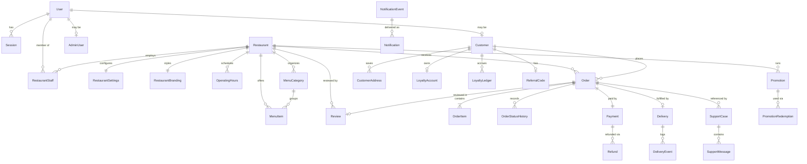

# 5. Domain Model

Entities are grouped by owning module. For each: purpose, key fields, relationships, ownership (which tenant it belongs to), lifecycle, and the constraints that matter.

**Conventions applied to every entity**

- Primary key: `id UUID` (UUIDv7, time-sortable).
- Timestamps: `created_at`, `updated_at` — `TIMESTAMPTZ`, always UTC.
- Money: `BIGINT` minor units (paise) with a sibling `currency CHAR(3)` where an amount can stand alone. Never `FLOAT`/`DOUBLE`/`REAL`.
- Tenant scoping: every restaurant-owned row carries a non-null `restaurant_id`.
- Soft delete only where history matters; otherwise archive via a status field. Financial records are never deleted.

---

## 5.1 Identity

### User

**Purpose:** A human principal who can authenticate. Covers restaurant users, admins, and registered customers. Guests have no User row.
**Key fields:** `email` (nullable, unique when present), `phone` (nullable, unique when present), `password_hash` (nullable — OTP-only customers have none), `full_name`, `status` (ACTIVE / DISABLED), `email_verified_at`, `phone_verified_at`, `mfa_secret` (nullable, encrypted), `mfa_enabled_at`, `last_login_at`.
**Relationships:** has many `Session`, many `RestaurantStaff`, optional one `Customer`, optional one `AdminUser`.
**Ownership:** platform.
**Lifecycle:** created on registration → verified → active → optionally disabled. Never hard-deleted; disabling revokes all sessions.
**Constraints:** at least one of `email`/`phone` must be present. A DISABLED user fails authentication and all authorization checks.

### Session

**Purpose:** Server-side record making refresh tokens revocable.
**Key fields:** `user_id`, `refresh_token_hash` (argon2id, never the raw token), `user_agent`, `ip_hash`, `expires_at`, `revoked_at`, `rotated_from_id`.
**Lifecycle:** issued at login → rotated on each refresh → revoked at logout / password change / staff removal / admin action.
**Constraints:** reuse of an already-rotated refresh token is a **token-theft signal**: revoke the entire session family and log a security event.

### AdminUser

**Purpose:** Platform-staff role assignment, kept separate from restaurant membership so admin privilege can never be acquired through restaurant paths.
**Key fields:** `user_id` (unique), `role` (SUPER_ADMIN / OPERATIONS / SUPPORT / FINANCE), `status`.
**Constraints:** MFA required. The system must always retain at least one active SUPER_ADMIN.

### OtpChallenge

**Purpose:** Phone/email verification and customer login.
**Key fields:** `identifier` (phone or email), `purpose`, `code_hash`, `attempts`, `max_attempts`, `expires_at`, `consumed_at`.
**Constraints:** single-use; rate-limited per identifier and per IP; codes stored hashed.

---

## 5.2 Restaurant (tenant root)

### Restaurant

**Purpose:** The tenant. Everything restaurant-scoped hangs off this.
**Key fields:** `slug` (unique, URL identity), `name`, `description`, `phone`, `email`, `timezone` (IANA, default `Asia/Kolkata`), `status`, `onboarding_status`, `ordering_enabled`, `avg_prep_minutes`, `rating_avg`, `rating_count`, `search_vector`.
**Relationships:** one `RestaurantAddress`, one `RestaurantBranding`, one `RestaurantSettings`, many `RestaurantStaff`, `MenuCategory`, `MenuItem`, `Order`, `Promotion`, `Review`, `OperatingHours`, `ClosurePeriod`.
**Lifecycle:** `DRAFT → PENDING_APPROVAL → ACTIVE → (SUSPENDED | CLOSED)`. See state machines.
**Constraints:** slug is lowercase alphanumeric with hyphens, 3–63 chars, checked against a reserved-word list (`admin`, `api`, `support`, `app`, `www`, `r`, `static`, `assets`, `health`).

> **Critical distinction.** Four different things can stop ordering, and they must not be collapsed into one field:
> `status` (platform-controlled lifecycle) · `ordering_enabled` (restaurant's own switch) · `OperatingHours` (schedule) · `ClosurePeriod` (temporary override).
> A platform SUSPENDED restaurant must not be able to make itself orderable by flipping `ordering_enabled`.

### RestaurantAddress

Pickup address for delivery and the public location. Fields: `line1`, `line2`, `locality`, `city`, `state`, `postal_code`, `latitude`, `longitude`, `landmark`.

### RestaurantBranding

`logo_url`, `cover_image_url`, `theme_primary_color`, `theme_accent_color`, `tagline`. Kept separate so the public page can fetch it cheaply.

### RestaurantSettings

`min_order_amount`, `packaging_fee`, `delivery_fee_mode`, `delivery_fee_flat`, `accepts_online_payment`, `auto_accept_orders`, `notification_emails`, `notification_phones`.

### OperatingHours

Per weekday: `day_of_week` (0–6), `opens_at`/`closes_at` (`TIME`), `is_closed`. Multiple rows per day allow split shifts. Interpreted in the restaurant's timezone. `closes_at <= opens_at` denotes an overnight window (e.g. 22:00→02:00).

### SpecialHours

Date-specific override: `date`, `is_closed`, `opens_at`, `closes_at`. Takes precedence over `OperatingHours`.

### ClosurePeriod

Temporary closure: `starts_at`, `ends_at` (nullable = indefinite), `reason`, `created_by_user_id`.

### RestaurantStaff

**Purpose:** Membership linking a User to a Restaurant with a role.
**Key fields:** `user_id`, `restaurant_id`, `role` (OWNER / MANAGER / STAFF), `status` (INVITED / ACTIVE / DISABLED), `invited_by_user_id`, `joined_at`, `disabled_at`.
**Constraints:** unique `(user_id, restaurant_id)`. Every restaurant must have at least one ACTIVE OWNER — the last one cannot be removed or demoted.

### StaffInvitation

`restaurant_id`, `email`, `role`, `token_hash`, `expires_at`, `accepted_at`, `revoked_at`. Single-use, expiring; the raw token appears only in the emailed link.

---

## 5.3 Catalog

### MenuCategory

`restaurant_id`, `name`, `description`, `display_order`, `is_active`, `archived_at`. Unique `(restaurant_id, name)` among non-archived rows.

### MenuItem

**Key fields:** `restaurant_id`, `category_id`, `name`, `description`, `price_minor`, `currency`, `image_url`, `is_available`, `is_active`, `display_order`, `dietary_tag` (VEG / NON_VEG / EGG / UNKNOWN), `archived_at`, `search_vector`.
**Lifecycle:** created → active → optionally unavailable (temporary) → archived (permanent, soft).
**Constraints:** `price_minor > 0`. **Never hard-delete** — historical orders reference these rows for display context even though they carry their own price snapshots.

> **Three distinct states, do not conflate:** `is_active` (exists on the menu) · `is_available` (orderable right now) · `archived_at` (removed from menu, retained for history).

### MenuItemImage

Optional multi-image support: `menu_item_id`, `url`, `display_order`. For v1 a single `image_url` on MenuItem is sufficient; add this table only if multi-image is requested.

---

## 5.4 Customer

### Customer

**Purpose:** The ordering party. May exist without a User (guest).
**Key fields:** `user_id` (nullable — null means guest), `full_name`, `phone`, `email` (nullable), `phone_verified_at`, `default_address_id`, `marketing_consent_at`, `status`.
**Ownership:** platform-level, **not** restaurant-scoped. A customer may order from many restaurants. Restaurants see only their own orders' customer data.
**Constraints:** `phone` is the identity key for guest deduplication. Unique on `phone` where `user_id IS NOT NULL`; guests may repeat.

> **Guest vs registered:** guests can order and track orders. Loyalty, referrals, notification preferences, and support history require a registered Customer (`user_id` present). See AMB-2.

### CustomerAddress

`customer_id`, `label`, `recipient_name`, `recipient_phone`, `line1`, `line2`, `locality`, `city`, `state`, `postal_code`, `landmark`, `latitude`, `longitude`, `is_default`, `archived_at`.

---

## 5.5 Ordering

### Cart

**Purpose:** Server-side cart used for validation and checkout. The browser holds a local copy for UX; the server copy is authoritative at checkout.
**Key fields:** `id`, `restaurant_id`, `customer_id` (nullable), `guest_token_hash`, `status` (OPEN / CONVERTED / ABANDONED), `expires_at`.
**Constraints:** a cart belongs to exactly **one** restaurant. Adding an item from another restaurant is rejected — see BR-31.

### CartItem

`cart_id`, `menu_item_id`, `quantity`, `unit_price_minor_at_add` (for change detection only — never authoritative for payment).

### Order

**Purpose:** The central financial and operational record.
**Key fields:**
`order_number` (public, unique, human-readable), `restaurant_id`, `customer_id`, `status`, `placed_at`, `accepted_at`, `ready_at`, `delivered_at`, `cancelled_at`, `cancellation_reason`, `rejection_reason`,
customer snapshot: `customer_name`, `customer_phone`,
delivery snapshot: `delivery_address` (JSONB — full address as at order time),
pricing snapshot: `items_subtotal_minor`, `packaging_fee_minor`, `delivery_fee_minor`, `platform_fee_minor`, `tax_minor`, `discount_minor`, `loyalty_discount_minor`, `payable_total_minor`, `currency`, `pricing_breakdown` (JSONB — full itemised trace),
references: `promotion_id`, `coupon_code`, `applied_loyalty_points`, `idempotency_key`.
**Ownership:** restaurant tenant, plus customer.
**Lifecycle:** see state machine.
**Constraints:** `payable_total_minor >= 0`; `order_number` unique; `idempotency_key` unique per restaurant. **All snapshot fields are immutable after creation.**

### OrderItem

`order_id`, `menu_item_id` (reference for analytics), `name_snapshot`, `description_snapshot`, `unit_price_minor_snapshot`, `quantity`, `line_total_minor`.
**Constraints:** immutable. `line_total_minor = unit_price_minor_snapshot * quantity`, enforced by CHECK.

### OrderStatusHistory

Append-only: `order_id`, `from_status`, `to_status`, `actor_type`, `actor_id`, `reason`, `metadata`, `created_at`. Never updatable or deletable through any API.

---

## 5.6 Payments

### Payment

**Key fields:** `order_id`, `provider`, `provider_payment_id`, `provider_order_id`, `status`, `amount_minor`, `currency`, `captured_minor`, `refunded_minor`, `method`, `failure_code`, `failure_message`, `authorized_at`, `captured_at`, `idempotency_key`, `reconciliation_status`.
**Constraints:** unique `(provider, provider_payment_id)` — the primary defence against duplicate webhook processing. `refunded_minor <= captured_minor` enforced by CHECK (INV-6). `captured_minor <= amount_minor`.
**Note:** payment status is a **separate field from order status**. Never merge them.

### Refund

`payment_id`, `order_id`, `amount_minor`, `reason`, `status`, `provider_refund_id`, `initiated_by_actor_type`, `initiated_by_actor_id`, `idempotency_key`, `completed_at`, `failure_reason`.
**Constraints:** unique `(payment_id, idempotency_key)`; unique `provider_refund_id` where present. Sum of non-failed refunds must not exceed `payment.captured_minor` — enforced by locking the Payment row during creation.

### WebhookEvent

**Purpose:** Raw external event store; the idempotency anchor for all provider callbacks.
**Key fields:** `provider`, `provider_event_id`, `event_type`, `signature_valid`, `payload` (JSONB), `status` (RECEIVED / PROCESSED / FAILED / IGNORED), `processed_at`, `attempts`, `last_error`, `received_at`.
**Constraints:** unique `(provider, provider_event_id)`. Persist **before** processing, always.

### ReconciliationIssue

`entity_type`, `entity_id`, `issue_type`, `expected`, `actual`, `severity`, `status` (OPEN / INVESTIGATING / RESOLVED), `resolution_note`, `resolved_by`, `detected_at`.
**Rule:** reconciliation **records** mismatches; it never silently corrects financial data.

---

## 5.7 Delivery

### Delivery

`order_id` (unique), `provider`, `provider_delivery_id`, `status`, `pickup_address` (JSONB), `dropoff_address` (JSONB), `courier_name`, `courier_phone`, `tracking_url`, `quoted_fee_minor`, `actual_fee_minor`, `estimated_pickup_at`, `estimated_delivery_at`, `picked_up_at`, `delivered_at`, `cancellation_reason`, `failure_reason`, `idempotency_key`, `attempt_count`.
**Constraints:** unique `order_id` (one delivery per order — the core duplicate-dispatch defence); unique `(provider, provider_delivery_id)`.

### DeliveryEvent

Append-only provider event log: `delivery_id`, `provider_event_id`, `event_type`, `status_after`, `occurred_at`, `payload`. Unique `(delivery_id, provider_event_id)`.

---

## 5.8 Promotions

### Promotion

`restaurant_id` (nullable — null means platform-wide), `code` (nullable — null means automatic), `name`, `type` (PERCENTAGE / FIXED_AMOUNT / FREE_DELIVERY), `value`, `min_order_minor`, `max_discount_minor`, `starts_at`, `ends_at`, `usage_limit_total`, `usage_limit_per_customer`, `first_order_only`, `is_active`, `created_by_user_id`, `archived_at`.
**Constraints:** unique `code` where active and non-archived. `usage_count` is **not** stored as a mutable counter on this row — it is derived from `PromotionRedemption`, which is what makes the limit race-safe.

### PromotionRedemption

**Purpose:** The concurrency-safe usage record and reservation.
**Key fields:** `promotion_id`, `customer_id`, `order_id` (nullable while reserved), `status` (RESERVED / CONFIRMED / RELEASED), `discount_minor`, `reserved_at`, `expires_at`, `confirmed_at`.
**Constraints:** unique `(promotion_id, order_id)`. Enforce per-customer limits with a partial unique index over non-RELEASED rows. See BR-52.

---

## 5.9 Loyalty

### LoyaltyAccount

`customer_id` (unique), `balance_points`, `lifetime_earned`, `lifetime_redeemed`, `status`.
**Rule:** `balance_points` is a **derived cache**. `LoyaltyLedger` is authoritative; a reconciliation job compares them.

### LoyaltyLedger

Append-only: `customer_id`, `type` (ORDER_EARN / REDEMPTION / REFUND_CLAWBACK / ADMIN_ADJUSTMENT / EXPIRATION / REFERRAL_REWARD), `points` (signed — positive credits, negative debits), `reference_type`, `reference_id`, `description`, `actor_type`, `actor_id`, `idempotency_key`, `created_at`.
**Constraints:** unique `(type, reference_type, reference_id)` for automatic types — this is what makes double-award impossible. Rows are **never updated or deleted**.

---

## 5.10 Referrals

### ReferralCode

`customer_id` (unique), `code` (unique), `is_active`.

### Referral

`referrer_customer_id`, `referred_customer_id` (unique — one referrer per customer), `referral_code`, `status` (PENDING / QUALIFIED / REWARDED / EXPIRED / INVALIDATED), `qualifying_order_id`, `attributed_at`, `qualified_at`, `rewarded_at`, `expires_at`.
**Constraints:** unique `referred_customer_id`; CHECK `referrer_customer_id <> referred_customer_id` (self-referral blocked at the database level); unique `qualifying_order_id`.

---

## 5.11 Reviews

### Review

`order_id` (unique — one review per order), `customer_id`, `restaurant_id`, `rating` (1–5), `body`, `status` (PUBLISHED / PENDING_REVIEW / HIDDEN / REMOVED), `moderated_by_user_id`, `moderation_reason`, `moderated_at`.
**Constraints:** unique `order_id`; CHECK `rating BETWEEN 1 AND 5`; the order must be DELIVERED and belong to this customer and restaurant.

### ReviewResponse

`review_id` (unique), `restaurant_id`, `author_user_id`, `body`, `created_at`.

### ReviewReport

`review_id`, `reporter_type`, `reporter_id`, `reason`, `status`, `resolved_by`, `resolved_at`. Unique `(review_id, reporter_type, reporter_id)` prevents report spam.

---

## 5.12 Support

### SupportCase

`case_number` (unique), `customer_id` (nullable), `restaurant_id` (nullable), `order_id` (nullable), `category`, `priority`, `status`, `subject`, `description`, `assigned_to_user_id`, `resolved_at`, `resolution_note`, `first_response_at`.
**Ownership:** exactly one of `customer_id` / `restaurant_id` identifies the reporter; both may be present when a case concerns an order.

### SupportMessage

`case_id`, `author_type` (CUSTOMER / RESTAURANT / AGENT / SYSTEM), `author_id`, `visibility` (**INTERNAL** / PUBLIC), `body`, `created_at`.
**Critical:** `INTERNAL` messages must never be returned by any customer- or restaurant-facing endpoint. Enforce in the query layer, not by filtering in the frontend.

### SupportAttachment

`case_id`, `message_id`, `uploaded_by_type`, `uploaded_by_id`, `object_key`, `filename`, `content_type`, `size_bytes`. Private storage; access via short-lived signed URLs only.

---

## 5.13 Notifications

### NotificationEvent

Domain event record: `type`, `reference_type`, `reference_id`, `payload`, `idempotency_key` (unique), `created_at`.

### Notification

Per-recipient, per-channel delivery record: `event_id`, `recipient_type`, `recipient_id`, `channel` (IN_APP / EMAIL / SMS / WHATSAPP / PUSH), `type`, `title`, `body`, `status` (PENDING / SENT / DELIVERED / FAILED / SUPPRESSED), `read_at`, `attempts`, `last_error`, `provider_message_id`, `sent_at`.
**Constraints:** unique `(event_id, recipient_type, recipient_id, channel)` — the guarantee against duplicate sends.

### NotificationPreference

`recipient_type`, `recipient_id`, `category` (TRANSACTIONAL / ACCOUNT / SECURITY / MARKETING), `channel`, `enabled`.
**Rule:** TRANSACTIONAL and SECURITY categories are **not disableable** (BR-77).

### DeviceToken

`user_id`, `token`, `platform`, `last_seen_at`, `revoked_at`. Only if push is implemented; one user may have many devices.

---

## 5.14 Analytics

### AnalyticsEvent

Append-only: `type`, `occurred_at`, `session_id`, `customer_id` (nullable), `restaurant_id` (nullable), `order_id` (nullable), `properties` (JSONB), `idempotency_key`.
**Rule:** never contains PII beyond internal identifiers; never used as a transactional source of truth.

### DailyRestaurantMetrics

Rollup: `restaurant_id`, `date` (in restaurant timezone), `orders_placed`, `orders_completed`, `orders_cancelled`, `orders_rejected`, `gross_order_value_minor`, `discount_minor`, `refund_minor`, `net_order_value_minor`, `avg_order_value_minor`, `avg_prep_seconds`. Unique `(restaurant_id, date)`; recomputable and idempotent.

### DailyPlatformMetrics

Same shape at platform scope, plus payment success rate, delivery success rate, and support case counts.

---

## 5.15 Audit

### AuditLog

**Purpose:** Append-only record of every privileged or state-changing action.
**Key fields:** `actor_type` (CUSTOMER / RESTAURANT_USER / ADMIN / SYSTEM), `actor_id`, `action`, `entity_type`, `entity_id`, `restaurant_id` (nullable, for tenant filtering), `before` (JSONB, redacted), `after` (JSONB, redacted), `reason`, `correlation_id`, `ip_hash`, `created_at`.
**Constraints:** no UPDATE or DELETE path exists in application code. Database privileges should grant the application role INSERT and SELECT only on this table.

---

## 5.16 Entity relationship overview

