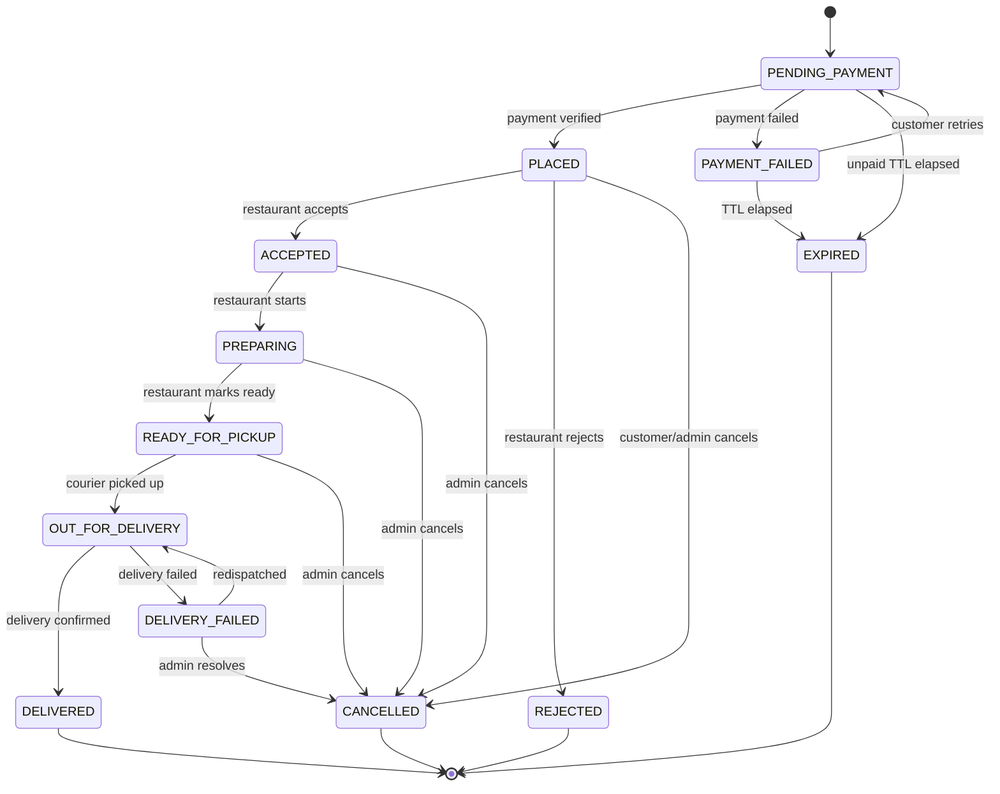
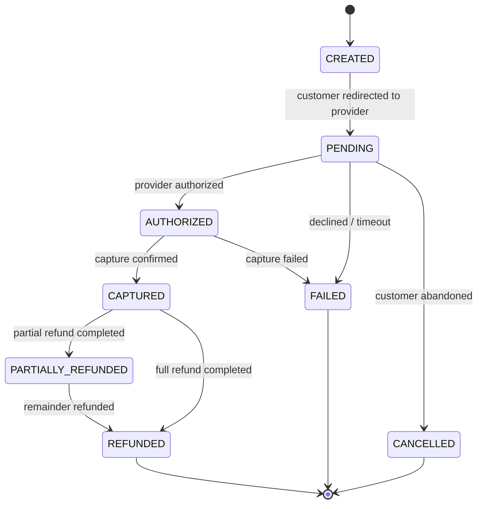
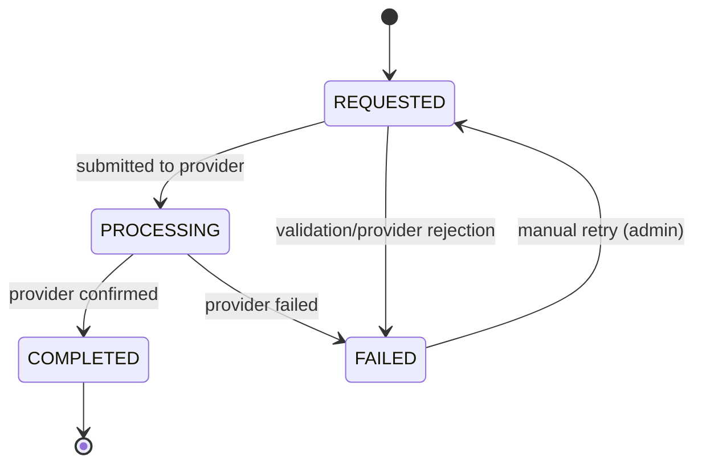
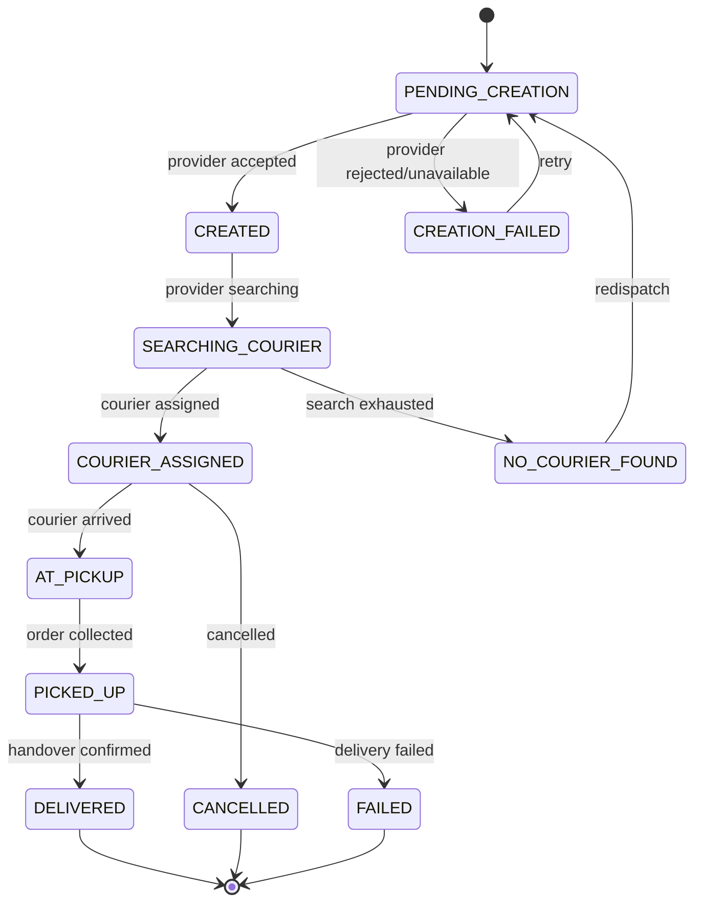
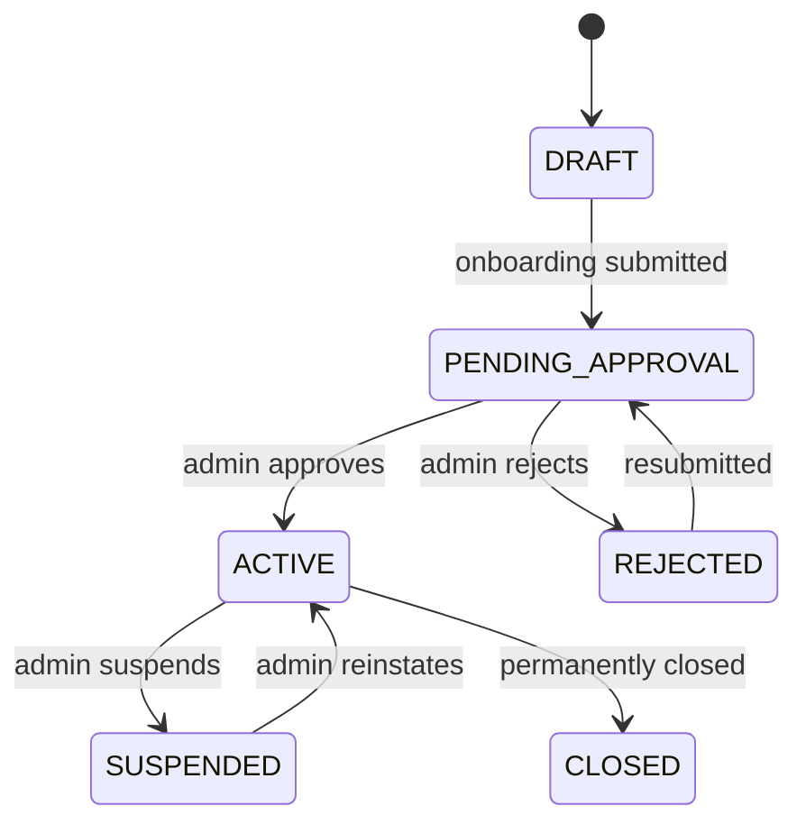
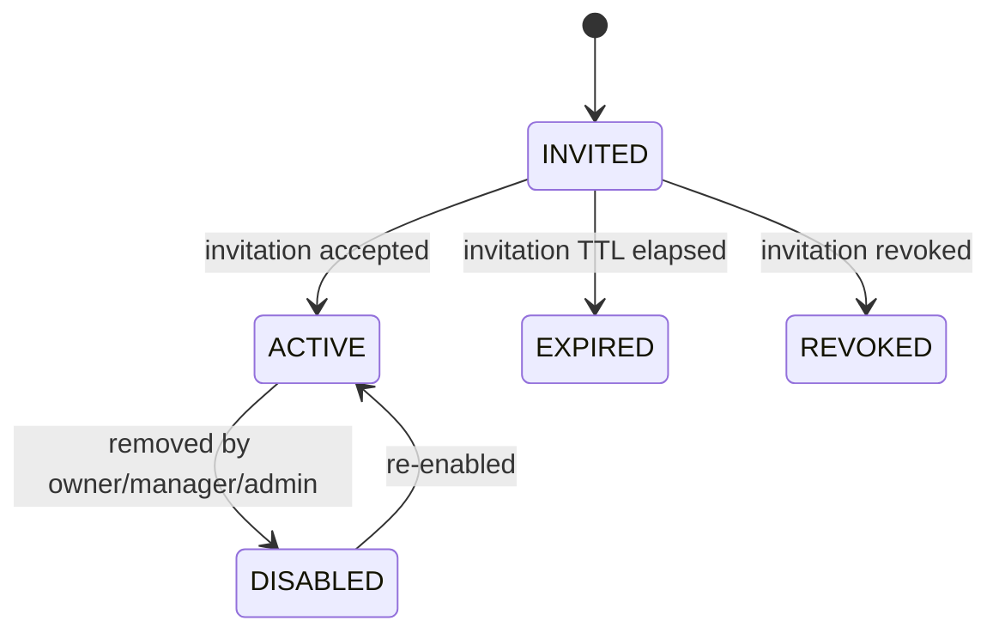
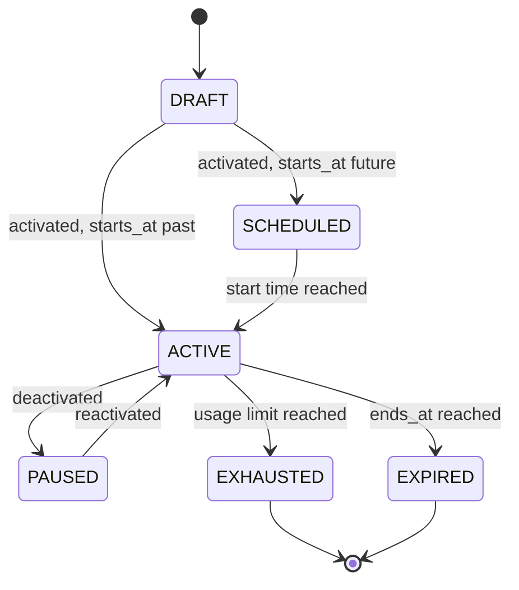
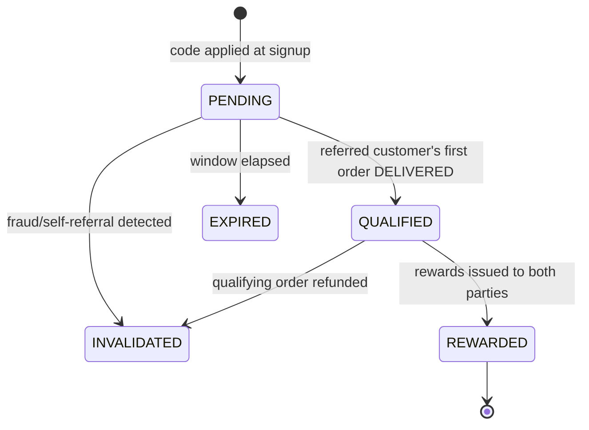
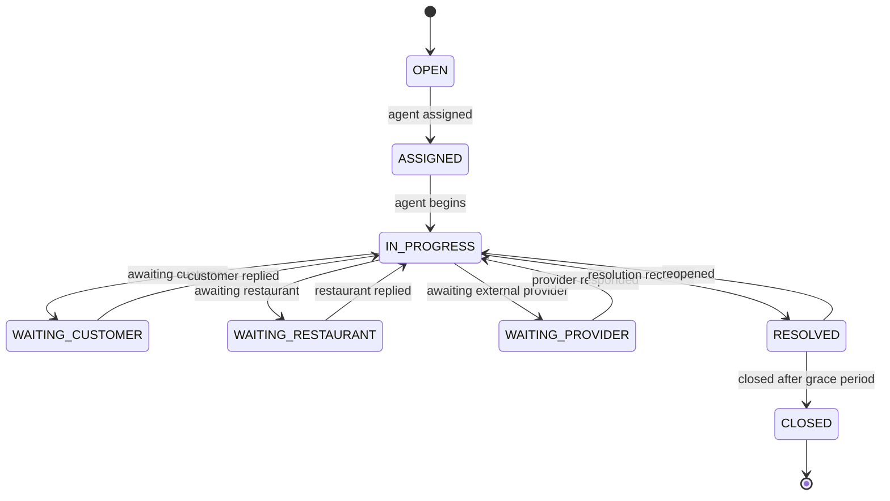

# 7. State Machines

Nine machines. All transitions go through a single service per aggregate; no controller, worker, or admin path writes a status column directly.

**Universal rules**

1. A transition validates: current state → target state is legal, the actor is permitted, and preconditions hold. All three, in that order.
2. The row is locked (`SELECT ... FOR UPDATE`) before reading current state, so concurrent transitions serialise.
3. State change and history insert are in the **same transaction**.
4. Side effects (notifications, dispatch, rewards) are emitted as events **after commit**, never inside the transaction.
5. An illegal transition returns **409 Conflict** with the current state — it is never a silent no-op, and never a 500.
6. Re-requesting a transition that already happened returns **200 with the current state** (idempotent), not 409. Distinguish "already in target state" from "cannot reach target state".

---

## 7.1 Order



### Transition table

| From                                             | To               | Actor                                            | Preconditions                                                   | Side effects                                                          |
| ------------------------------------------------ | ---------------- | ------------------------------------------------ | --------------------------------------------------------------- | --------------------------------------------------------------------- |
| —                                                | PENDING_PAYMENT  | SYSTEM (checkout)                                | Cart validated, pricing computed, payment intent created        | Promotion + loyalty **reserved**                                      |
| PENDING_PAYMENT                                  | PLACED           | SYSTEM (verified payment)                        | Payment CAPTURED, amount matches `payable_total_minor` exactly  | Confirm reservations; notify restaurant + customer; emit ORDER_PLACED |
| PENDING_PAYMENT                                  | PAYMENT_FAILED   | SYSTEM                                           | Provider reports failure                                        | Release reservations; notify customer                                 |
| PENDING_PAYMENT                                  | EXPIRED          | SYSTEM (job)                                     | Older than `ORDER_PAYMENT_TTL_MINUTES` (default 30), no capture | Release reservations. Records retained                                |
| PAYMENT_FAILED                                   | PENDING_PAYMENT  | CUSTOMER                                         | Within TTL; cart still valid; **re-validate and re-price**      | New payment attempt on the **same order**                             |
| PLACED                                           | ACCEPTED         | RESTAURANT (OWNER/MANAGER/STAFF)                 | Restaurant not suspended                                        | Notify customer; start prep timer                                     |
| PLACED                                           | REJECTED         | RESTAURANT                                       | Reason required                                                 | **Trigger full refund**; notify customer; release loyalty/promotion   |
| PLACED / ACCEPTED / PREPARING / READY_FOR_PICKUP | CANCELLED        | ADMIN (or CUSTOMER only while PLACED, see AMB-6) | Reason required                                                 | Refund per policy; cancel delivery if created; notify all             |
| ACCEPTED                                         | PREPARING        | RESTAURANT                                       | —                                                               | Notify customer                                                       |
| PREPARING                                        | READY_FOR_PICKUP | RESTAURANT                                       | —                                                               | **Enqueue delivery dispatch**; notify customer                        |
| READY_FOR_PICKUP                                 | OUT_FOR_DELIVERY | SYSTEM (delivery webhook)                        | Delivery PICKED_UP                                              | Notify customer                                                       |
| OUT_FOR_DELIVERY                                 | DELIVERED        | SYSTEM (delivery webhook)                        | Delivery DELIVERED                                              | Grant loyalty; qualify referral; enable review; notify                |
| OUT_FOR_DELIVERY                                 | DELIVERY_FAILED  | SYSTEM                                           | Provider reports failure                                        | Alert restaurant + admin; create support case                         |

### Explicitly forbidden

`DELIVERED → *` (terminal) · `CANCELLED → *` · `REJECTED → *` · `EXPIRED → *` · `PLACED → PREPARING` (must accept first) · `ACCEPTED → READY_FOR_PICKUP` (must pass through PREPARING) · any backwards move.

**There is no admin override that bypasses this machine.** If an operational correction is genuinely needed, the correct action is a compensating operation (refund, support case, manual note) — not a status rewrite. This is deliberate: an admin who can move DELIVERED back to PREPARING can destroy financial reconciliation.

### Concurrency

Two staff accepting simultaneously: both transactions attempt `SELECT ... FOR UPDATE` on the order. The first commits PLACED→ACCEPTED; the second re-reads ACCEPTED and returns **200 idempotent** (same target state, already reached). Two staff performing _different_ transitions — one accepts, one rejects — the loser gets **409** with current state. Exactly one refund can ever be triggered.

---

## 7.2 Payment



| Rule           | Detail                                                                                                                                                                   |
| -------------- | ------------------------------------------------------------------------------------------------------------------------------------------------------------------------ |
| Authority      | Only the payments module writes payment state, only in response to a **verified** provider signal                                                                        |
| Monotonicity   | Never regress. A `payment.authorized` webhook arriving after CAPTURED is **ignored and logged**, not applied                                                             |
| Out-of-order   | Compare provider event timestamp / sequence. Older event than current state → ignore, record in `webhook_events` as IGNORED                                              |
| Amount check   | If provider amount ≠ `order.payable_total_minor`, do **not** mark CAPTURED. Set `reconciliation_status = 'AMOUNT_MISMATCH'`, raise a CRITICAL ReconciliationIssue, alert |
| Currency check | Mismatch is treated identically to amount mismatch                                                                                                                       |
| Frontend       | A frontend "payment success" callback triggers a **server-side verification fetch**. It never writes state on its own                                                    |

---

## 7.3 Refund



**Creation guard** (inside one transaction): lock the payment row → sum non-FAILED refunds → reject if `sum + new > captured_minor` → insert. This is what makes INV-6 hold under concurrency.

| Trigger                          | Amount                                         | Initiator                       |
| -------------------------------- | ---------------------------------------------- | ------------------------------- |
| Restaurant rejects a paid order  | Full                                           | SYSTEM (automatic)              |
| Admin cancels before delivery    | Full (see AMB-7)                               | ADMIN                           |
| Support-approved goodwill refund | Partial or full                                | ADMIN / SUPPORT with permission |
| Delivery permanently failed      | Per policy — REQUIRES PRODUCT DECISION (AMB-8) | ADMIN                           |

Refund status is only ever COMPLETED on **provider confirmation**. Customers are shown "Refund initiated" until then — never "Refunded".

---

## 7.4 Delivery



| Rule                | Detail                                                                                                                                                             |
| ------------------- | ------------------------------------------------------------------------------------------------------------------------------------------------------------------ |
| One per order       | `UNIQUE (order_id)`. "Mark ready" twice creates exactly one delivery — the second insert hits the constraint and is treated as success                             |
| Timeout ≠ failure   | A provider timeout after the request may mean the delivery **was** created. Never blindly retry: reconcile by provider idempotency key or query the provider first |
| Out-of-order events | `DELIVERED` arriving before `PICKED_UP`: apply the terminal state, record the anomaly, do not error. Regressions (DELIVERED → PICKED_UP) are ignored               |
| Event idempotency   | `UNIQUE (delivery_id, provider_event_id)`                                                                                                                          |
| Order coupling      | Delivery state drives order state only for READY_FOR_PICKUP → OUT_FOR_DELIVERY → DELIVERED. A delivery failure never corrupts payment records                      |

---

## 7.5 Restaurant



| State            | Public page           | New orders   | Staff login                                | Existing orders               |
| ---------------- | --------------------- | ------------ | ------------------------------------------ | ----------------------------- |
| DRAFT            | 404                   | No           | Yes                                        | n/a                           |
| PENDING_APPROVAL | 404                   | No           | Yes                                        | n/a                           |
| ACTIVE           | Visible               | Yes, if open | Yes                                        | Manageable                    |
| SUSPENDED        | "Unavailable"         | **No**       | Yes, read-only + existing order management | **Must still be fulfillable** |
| CLOSED           | "No longer available" | No           | Read-only                                  | Manageable until complete     |

**Suspension does not cancel or refund existing orders.** Orders in flight complete normally; only new order creation is blocked. Suspending a restaurant mid-service must never strand a paid customer.

### Ordering availability — one authoritative function

`isAcceptingOrders(restaurantId, at)` returns a decision plus a reason code, and is the **only** place this logic lives. It is consumed by the public page, the search "open now" filter, and checkout revalidation, so all three always agree.

```
ACCEPTING  — everything below passes
SUSPENDED  — status != ACTIVE
DISABLED   — ordering_enabled = false
CLOSED_NOW — outside OperatingHours / SpecialHours in restaurant timezone
ON_BREAK   — inside an active ClosurePeriod
```

Precedence: `status` → `ClosurePeriod` → `SpecialHours` → `OperatingHours` → `ordering_enabled`. Overnight windows (`closes_at <= opens_at`) span midnight and must be tested explicitly.

---

## 7.6 Staff membership



Transitioning to DISABLED **revokes all sessions for that user scoped to that restaurant** immediately. A disabled staff member must lose access within the access-token TTL at worst — 15 minutes — and immediately for any refresh. The last ACTIVE OWNER of a restaurant cannot be disabled or demoted.

---

## 7.7 Promotion



ACTIVE is derived at validation time from `is_active`, `starts_at`, `ends_at`, and live redemption count — not from a stored status that could go stale. Existing orders that already used a promotion are unaffected by later state changes (INV-8).

### Redemption sub-state

`RESERVED` (held at checkout, TTL matches order payment TTL) → `CONFIRMED` (payment captured) or `RELEASED` (payment failed/expired/order cancelled). Reservation is what stops a coupon being consumed by an abandoned checkout while still preventing over-issue during a concurrent rush.

---

## 7.8 Referral



Qualification requires a **DELIVERED** order — not signup, not payment. `UNIQUE (qualifying_order_id)` plus the loyalty ledger's reference-uniqueness make double-reward structurally impossible even under duplicate event delivery.

---

## 7.9 Support case



SLA clocks pause during `WAITING_*` states. Time-to-first-response measures OPEN → first PUBLIC agent message.
