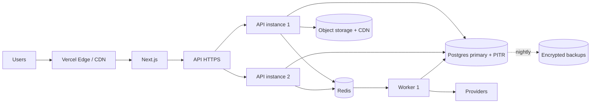

# 16–17. Infrastructure and Deployment

# 16. Infrastructure

## 16.1 Environments

| Environment    | Purpose         | Database                   | Payments      | Delivery                      | Notifications                            |
| -------------- | --------------- | -------------------------- | ------------- | ----------------------------- | ---------------------------------------- |
| **local**      | Development     | Docker Postgres + Redis    | Razorpay test | Mock                          | Console adapter                          |
| **test**       | Automated tests | Testcontainers, ephemeral  | Stub          | Mock                          | Memory adapter                           |
| **staging**    | Pre-production  | Managed, separate instance | Razorpay test | Mock or provider sandbox      | Real providers, internal recipients only |
| **production** | Live            | Managed + PITR             | Razorpay live | Provider live (when approved) | Real providers                           |

**Hard separations.** Staging never holds production payment credentials. Development never connects to the production database. Production startup **fails loudly** if a sandbox payment key is detected — a silent fallback to test mode would mean taking orders that collect no money.

## 16.2 Production topology



Minimum production footprint: 2 API instances (rolling deploys, no single point of failure), 1–2 workers, managed Postgres with PITR, managed Redis, object storage with CDN.

## 16.3 Configuration

Validated at startup with a Zod schema. **The process refuses to start if a required production variable is missing** — a clear crash is far better than silently running with an unsafe default.

```
# Application
NODE_ENV, APP_ENV, PORT, API_BASE_URL, WEB_BASE_URL, LOG_LEVEL

# Database
DATABASE_URL, DATABASE_POOL_MAX

# Redis
REDIS_URL

# Auth
JWT_SECRET, JWT_ACCESS_TTL, REFRESH_TOKEN_TTL, COOKIE_DOMAIN, ARGON2_MEMORY_KB

# Payments
PAYMENT_PROVIDER, RAZORPAY_KEY_ID, RAZORPAY_KEY_SECRET, RAZORPAY_WEBHOOK_SECRET

# Delivery
DELIVERY_PROVIDER            # mock | uber_direct
UBER_DIRECT_CLIENT_ID, UBER_DIRECT_CLIENT_SECRET, UBER_DIRECT_WEBHOOK_SECRET

# Notifications
SMS_PROVIDER, MSG91_AUTH_KEY, MSG91_SENDER_ID
WHATSAPP_PROVIDER, GUPSHUP_API_KEY
EMAIL_PROVIDER, RESEND_API_KEY, EMAIL_FROM

# Storage
STORAGE_ENDPOINT, STORAGE_BUCKET, STORAGE_ACCESS_KEY, STORAGE_SECRET_KEY, CDN_BASE_URL

# Observability
SENTRY_DSN, SENTRY_ENVIRONMENT

# Business configuration
PLATFORM_FEE_BPS             # basis points, 0 during pilot
ORDER_PAYMENT_TTL_MINUTES    # default 30
LOYALTY_POINTS_PER_100_INR   # default 1
CART_TTL_HOURS               # default 24

# Feature flags
DISCOVERY_ENABLED            # default false — enabling launches Layer 2
LOYALTY_ENABLED, REFERRALS_ENABLED, REVIEWS_ENABLED, PROMOTIONS_ENABLED
PAYMENTS_LIVE_MODE           # explicit opt-in to real money
```

`.env.example` carries names and formats only, never real values.

## 16.4 Data protection

**Backups.** Managed Postgres automated daily backups with point-in-time recovery, 30-day retention, encrypted at rest, stored in a separate account or region from the database. Object storage uses versioning with a 30-day non-current retention window.

**A backup that has never been restored is not a backup.** Monthly restore drill: restore the latest backup to a temporary instance, run migrations check, boot the application against it, run smoke tests, record the result and duration, destroy the instance. Until a restore drill has passed, disaster recovery status is `NOT VERIFIED` and must be reported as such.

**Backup permissions are separate from application credentials** — a compromised application must not be able to delete its own backups.

| Objective | Target      | Current capability                      |
| --------- | ----------- | --------------------------------------- |
| RPO       | ≤ 5 minutes | PITR-dependent, confirm with provider   |
| RTO       | ≤ 2 hours   | Unverified until a restore drill passes |

## 16.5 Failure behaviour

| Dependency down   | Behaviour                                                                                                                         |
| ----------------- | --------------------------------------------------------------------------------------------------------------------------------- |
| Postgres          | API returns 503 on `/ready`, traffic drains. **No degraded write path** — inconsistent financial state is worse than downtime     |
| Redis             | Jobs pause and queue in the outbox; rate limiting fails **closed** for auth, open for reads; caching bypassed. Ordering continues |
| Payment provider  | Checkout blocked with a clear message. Never fabricate success. Existing orders continue to be fulfilled                          |
| Delivery provider | Orders accepted and prepared; dispatch queues and retries; restaurant and admin alerted. Order is **not** marked out for delivery |
| SMS/WhatsApp      | Notifications queue and retry; in-app notifications unaffected; business flows unaffected                                         |
| Object storage    | Existing CDN-cached images serve; new uploads fail with a clear error; ordering unaffected                                        |
| Search            | Falls back to category browse. Ordering unaffected                                                                                |

**Never degrade:** payment verification, authorization, tenant isolation, financial calculation, audit logging.

## 16.6 Cost profile (pilot scale)

| Item                      | Estimate/month |
| ------------------------- | -------------- |
| Vercel (frontend)         | $0–20          |
| API + worker hosting      | $20–40         |
| Managed Postgres          | $20–30         |
| Managed Redis             | $0–10          |
| Object storage + CDN (R2) | $1–5           |
| Sentry                    | $0–26          |
| SMS (~1,000 messages)     | ₹150–250       |
| **Total**                 | **≈ $50–120**  |

Payment gateway fees (~2% + GST) are transaction costs, not infrastructure. The first cost cliffs at growth are SMS volume and Postgres tier.

---

# 17. Deployment

## 17.1 Local setup

```bash
git clone <repo> && cd direct-order
pnpm install
cp .env.example .env          # fill in local values
docker compose up -d          # postgres + redis + minio
pnpm db:migrate
pnpm db:seed                  # demo restaurant, menu, users
pnpm dev                      # api :4000, web :3000, worker
```

`docker compose` provides only what the application genuinely needs. A new developer must reach a working local environment from the README alone.

## 17.2 CI pipeline

Every pull request:

```
install (cached) → typecheck → lint → format check
                 → unit tests → integration tests (Testcontainers Postgres)
                 → build frontend → build backend
                 → npm audit (fail on high/critical) → gitleaks secret scan
```

The pipeline fails the PR if any step fails. Failures are fixed, never suppressed.

Merge to `main` deploys to staging automatically, runs migrations, then runs smoke tests. Production deployment requires **manual approval**.

## 17.3 Deploy sequence

Order matters — a frontend expecting a not-yet-deployed API is a self-inflicted outage.

1. Back up the database (snapshot, record the identifier).
2. Run migrations — expand-only, backward compatible with the running version.
3. Deploy backend (rolling; `/ready` gates traffic).
4. Deploy workers.
5. Deploy frontend.
6. Smoke tests.
7. Watch error rate and payment success for 30 minutes.

Contract migrations (dropping columns) ship in a **later** deploy, once no running code references them.

## 17.4 Rollback

| Component      | Procedure                                                                                                                                                                                                                                       |
| -------------- | ----------------------------------------------------------------------------------------------------------------------------------------------------------------------------------------------------------------------------------------------- |
| Frontend       | Instant revert to previous deployment                                                                                                                                                                                                           |
| Backend/worker | Redeploy previous image tag                                                                                                                                                                                                                     |
| Configuration  | Restore previous values, restart                                                                                                                                                                                                                |
| Database       | **Do not blindly reverse a migration.** Expand-only migrations are backward compatible, so an application rollback alone is usually sufficient. Genuine data corruption uses PITR to a pre-incident timestamp — a deliberate, approved decision |

Rollback triggers: error rate above 5% for 5 minutes, payment success below 90%, authentication broken, any tenant-isolation failure, database corruption.

## 17.5 Health and shutdown

`/health` — liveness. Process responsive, no dependency checks. A database blip must not trigger a restart loop.
`/ready` — readiness. Database reachable, Redis reachable, migrations applied. Governs traffic.

Graceful shutdown on SIGTERM: stop accepting connections → drain in-flight requests (30s) → stop job intake → let running jobs finish (30s) → close pools → exit. Never terminate mid-financial-operation.

## 17.6 Monitoring and alerts

| Alert                        | Threshold              | Severity                   |
| ---------------------------- | ---------------------- | -------------------------- |
| API 5xx rate                 | > 2% for 5 min         | HIGH                       |
| `/ready` failing             | Any instance, 2 min    | CRITICAL                   |
| Payment success rate         | < 90% over 15 min      | CRITICAL                   |
| Webhook signature failures   | > 5 in 10 min          | CRITICAL (possible attack) |
| Reconciliation issue created | Any, severity CRITICAL | CRITICAL                   |
| Delivery dispatch failures   | > 20% over 30 min      | HIGH                       |
| Any DLQ non-empty            | ≥ 1                    | HIGH                       |
| Queue oldest job age         | > 10 min               | HIGH                       |
| Database connections         | > 80% of pool          | MEDIUM                     |
| Notification failure rate    | > 20% over 30 min      | MEDIUM                     |
| Backup job failed            | Any                    | HIGH                       |

Every alert names a runbook. An alert without a documented response is noise and should be deleted or fixed.

## 17.7 Operational runbooks

Write these in `docs/runbooks/` as the corresponding systems are built:

`payment-failure-spike` · `webhook-failures` · `database-outage` · `delivery-provider-outage` · `queue-backlog` · `bad-deployment` · `reconciliation-mismatch` · `suspected-data-breach` · `restore-from-backup`

Each contains: symptoms, diagnostic commands, immediate mitigation, recovery, verification, escalation.

## 17.8 External dependencies — status honesty

Report each as exactly one of `IMPLEMENTED` / `CONFIGURED` / `VERIFIED` / `REQUIRES EXTERNAL ACTION`. Never claim a state you have not observed.

| Dependency                         | Blocking?                                             |
| ---------------------------------- | ----------------------------------------------------- |
| Razorpay live account + KYC        | **Blocks real payments**                              |
| Payment settlement/legal structure | **Blocks real payments** (AMB-3)                      |
| Uber Direct API approval           | Blocks automated delivery; mock mode ships without it |
| MSG91 account + DLT templates      | Blocks SMS                                            |
| WhatsApp Business API approval     | Blocks WhatsApp; SMS is the fallback                  |
| Domain + DNS                       | Blocks production launch                              |
| Cloud accounts                     | Blocks production launch                              |
| Backup restore drill               | Blocks a truthful "disaster recovery ready" claim     |
