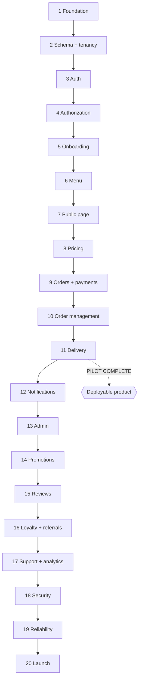

# 20. Implementation Phases

Twenty phases in dependency order. **Do not reorder.** Each phase produces something demonstrable and leaves the application in a working, tested, deployable state.

**Phases 1–11 are the pilot.** At the end of Phase 11 a real restaurant can take a real paid order and fulfil it. That is the commercially meaningful milestone — get there before building anything in Phase 12+.

Each phase completes only when: code is written, tests pass, lint and typecheck pass, both apps build, and the acceptance criteria in [14-acceptance-criteria.md](14-acceptance-criteria.md) are demonstrably met.

---

## PHASE 1 — Foundation

**Prerequisites:** none.

Monorepo scaffold per [12-repository-structure.md](12-repository-structure.md). NestJS API skeleton, Next.js app, worker entrypoint, shared `contracts` and `money` packages. Prisma with an empty schema and working migration pipeline. Docker Compose (Postgres, Redis, MinIO). ESLint/Prettier/TypeScript strict with the custom rules. Config validation that fails fast on missing production variables. Structured logging with correlation IDs. Global error filter and the response envelope. `/health` and `/ready`. Vitest and Playwright configured. GitHub Actions CI. `.env.example`, `.gitignore`, README.

**Do not build:** any business feature.

**Tests:** app boots · `/health` 200 · `/ready` reflects real database state · invalid request returns the standard error envelope · both apps build · money package round-trips and rejects float input.

**Acceptance:** a developer clones the repo and reaches a running local stack using only the README.

---

## PHASE 2 — Core schema and tenancy

**Prerequisites:** 1.

Prisma schema for User, Session, Restaurant, RestaurantAddress, RestaurantBranding, RestaurantSettings, RestaurantStaff, StaffInvitation, AuditLog. Enums for restaurant and staff status. All constraints and indexes from [02-database-schema.md](02-database-schema.md). The audit module (append-only, with database grants). The tenant-scoped repository base that **requires** a `restaurantId` argument. UUIDv7 generation. Seed script with two restaurants and multiple users — two restaurants from day one, so isolation is testable from the start.

**Tests:** migrations apply to a clean database · seed runs · unique constraints enforced (slug, staff membership) · audit rows cannot be updated or deleted · tenant repository rejects missing scope.

---

## PHASE 3 — Authentication

**Prerequisites:** 2.

Registration, login, logout, refresh with rotation and reuse detection, password reset, email verification, phone OTP. argon2id hashing. Cookie configuration. `GET /auth/me`. Rate limiting via Redis. Session revocation on password change and user disable. Frontend: signup, login, forgot/reset password, session context, protected route wrapper.

**Tests:** full flows · invalid credentials · disabled user · expired/invalid/tampered token · **refresh reuse revokes the family** · rate limits · **no account enumeration** (identical responses and comparable timing) · `/auth/me` never returns hashes or tokens.

---

## PHASE 4 — Authorization

**Prerequisites:** 3.

Permission catalogue and role definitions. `@Permissions` and `@TenantScoped` guards. Membership and status re-verified per request. Cross-tenant resources return 404 with a logged security event. The parameterised tenant-isolation test suite (initially covering the endpoints that exist).

**Tests:** the full authorization matrix · every escalation guard in §9.4 · disabled staff token rejected · client-supplied `restaurantId` ignored.

> This phase is load-bearing for everything after it. Do not proceed until the isolation suite is green.

---

## PHASE 5 — Restaurant onboarding and profile

**Prerequisites:** 4.

Restaurant creation with ownership derived from the session. Profile, address, branding, settings. Slug generation, validation, reserved words, uniqueness. Onboarding state machine. Presigned image upload with server-side validation and post-upload content verification. Staff invitations (hashed, expiring, single-use) and role management with last-owner protection. Frontend: onboarding wizard, profile, branding, settings, staff pages.

**Tests:** onboarding progression and resumption · `ownerId` in the request body is ignored · slug conflicts and reserved words · invitation expiry and reuse · **last owner cannot be removed or demoted** · disabling staff revokes sessions · cross-restaurant staff management returns 404 · upload rejects wrong type, oversized, and SVG.

---

## PHASE 6 — Menu management

**Prerequisites:** 5.

Categories and items with CRUD, archiving, reordering (transactional), availability toggle (STAFF-permitted), image upload. Frontend: menu management with accessible drag-and-drop plus a keyboard-accessible alternative.

**Tests:** CRUD · archive preserves references · concurrent reorder leaves consistent ordering · availability persists and is reflected publicly · price validation rejects zero, negative, and malformed values · cross-restaurant menu access returns 404 · long names and XSS payloads stored and rendered safely.

---

## PHASE 7 — Public ordering page

**Prerequisites:** 6.

`GET /public/restaurants/:slug` and its menu endpoint, exposing public fields only. `isAcceptingOrders()` — **the single availability authority** — with operating hours, special hours, closure periods, timezone handling, and overnight windows. In-restaurant menu search. SSR restaurant page with dynamic metadata and Open Graph tags. Menu display, category navigation, item cards, images with lazy loading, client cart with persistence, mobile-first responsive layout, accessibility.

**Tests:** valid slug renders · invalid slug 404 · suspended restaurant not exposed · unavailable items cannot be added · public response contains **no** staff, settings, or internal data (assert explicitly against a field allowlist) · **overnight hours** · timezone correctness · cart persists across refresh · cart rejects cross-restaurant items · keyboard navigation completes the browse flow.

---

## PHASE 8 — Pricing engine and cart validation

**Prerequisites:** 7.

The pricing engine: subtotal, packaging, delivery, platform fee, tax, rounding policy, full breakdown trace. Server-side cart validation with per-item issue codes. `POST /public/checkout/quote`. Frontend cart summary and validation messaging.

**Tests:** the exhaustive pricing suite from §18.3 · **no floating point in any path** · determinism · validation detects unavailable items, price changes, minimum-order violations, and restaurant closure · quote total exactly matches what checkout will charge.

---

## PHASE 9 — Orders, checkout, payments

**Prerequisites:** 8. **The highest-risk phase in the project.** Take it slowly; test it hardest.

Order and OrderItem schema with snapshots. Order number generation. Order state machine service. Checkout endpoint following the mandated sequence in §8.3. `PaymentProvider` interface, Razorpay adapter, payment intent creation. Webhook receiver: raw-body signature verification, store-then-enqueue, idempotent processing. Server-side payment verification. Refund service with locked-row validation. Reconciliation detection. Unpaid order expiry job. Outbox and event relay. Frontend: checkout flow, payment integration, confirmation, order tracking with guest access tokens.

**Tests:** every scenario in §18.3 for checkout, payments, and refunds — including all ten named failure scenarios: double-click pay · browser crash after payment · duplicate webhook · refresh after payment · price change mid-checkout · item unavailable mid-checkout · **provider/backend amount mismatch** · invalid webhook signature · cross-customer order access · concurrent identical checkouts.

**Acceptance:** an end-to-end sandbox payment produces exactly one order, correctly priced, verified server-side, with a full audit trail — and no failure scenario produces a duplicate order, duplicate charge, or incorrect state.

---

## PHASE 10 — Restaurant order management

**Prerequisites:** 9.

Order queue with server-side filtering and cursor pagination. Order detail. Accept, reject (with automatic refund), preparing, ready — all through the state service, all idempotent. Order status history. SSE live feed with `Last-Event-ID` replay and polling fallback. Notification event emission (delivery in Phase 12). Frontend dashboard orders section with new-order indication and deduplicated alerts.

**Tests:** order appears after payment verification · **two staff accepting concurrently** · double rejection creates one refund · invalid transitions 409 · restaurant sees only its own orders · **dashboard closed during payment then reconnects and sees the order** · SSE reconnect replays missed events · status history immutable.

---

## PHASE 11 — Delivery integration

**Prerequisites:** 10.

`DeliveryProvider` interface, `MockDeliveryProvider` (simulating the full lifecycle including failures), `UberDirectProvider` behind credentials. Delivery schema with `UNIQUE(order_id)`. Dispatch on READY_FOR_PICKUP via idempotent job. Delivery webhooks with signature verification and out-of-order handling. Order state coupling. Reconciliation. Customer tracking timeline and restaurant delivery view.

**Tests:** dispatch on ready · **"ready" twice creates one delivery** · provider timeout does not duplicate · provider rejection alerts without falsely marking out-for-delivery · duplicate webhook single effect · `DELIVERED` before `PICKED_UP` handled · cross-restaurant delivery access 404 · provider credentials never in any response.

**Report honestly:** if Uber Direct credentials are unavailable, state plainly that production delivery is not enabled and mock mode is active.

> **End of pilot.** At this point the product is commercially usable. Consider deploying to staging and running a real pilot before continuing.

---

## PHASE 12 — Notifications

**Prerequisites:** 11.

Notification event, notification, and preference schema. Channel adapters (SMS, email, WhatsApp, in-app) with a console adapter for development. Preference resolution with non-disableable transactional and security categories. Retry with backoff and dead-lettering. Notification centre with unread count. Frontend preferences page.

**Tests:** notification per state change · **duplicate event yields one notification per channel** · transactional cannot be disabled · marketing requires consent · **provider outage does not roll back an order** · dead-letter visible · cross-user access 404 · no PII in previews.

---

## PHASE 13 — Admin panel

**Prerequisites:** 12.

Admin roles and MFA enforcement. Restaurant management (approve, suspend, reinstate) through the state machine. User management. Cross-tenant order, payment, refund, delivery, and notification views with server-side pagination. Reconciliation queue. Audit log viewer (read-only). System health. Admin console frontend with explicit confirmation for destructive actions.

**Tests:** non-admin denied everywhere · restaurant owner cannot reach admin APIs · **refund exceeding captured rejected** · duplicate refund prevented · **DELIVERED cannot be moved to PREPARING** · suspension does not corrupt in-flight orders · every admin action audited · audit records not writable.

---

## PHASE 14 — Promotions

**Prerequisites:** 13.

Promotion and redemption schema. Eligibility engine. Reservation model with TTL. Row-locked usage limits. Integration into the pricing engine — **not a parallel discount path**. Checkout revalidation. Admin and restaurant promotion management. Customer coupon entry.

**Tests:** the full promotions suite from §18.3, especially **N+1 concurrent claims on a limit-N coupon yield exactly N** · reservation released on payment failure · anti-enumeration responses · restaurant cannot modify platform promotions.

---

## PHASE 15 — Reviews

**Prerequisites:** 14.

Review, response, and report schema. Eligibility from delivered orders. Moderation workflow. Rating aggregates with Bayesian scoring and recompute job. Public review display, restaurant response, admin moderation queue.

**Tests:** eligibility · one review per order under concurrency · **XSS payload safe in storage and render** · restaurant cannot hide or edit reviews · aggregates reconcile with published rows · public display exposes no customer contact details.

---

## PHASE 16 — Loyalty and referrals

**Prerequisites:** 15.

Loyalty account and append-only ledger with reference-uniqueness. Earn on delivery, redeem at checkout with row-locked balance, proportional refund clawback, optional expiry job, admin adjustment via ledger entry. Referral codes, attribution at signup, qualification on first delivered order, idempotent reward issuance through the loyalty ledger. Reconciliation for both. Customer wallet and referral pages.

**Tests:** the full loyalty and referral suites from §18.3 — especially **duplicate delivery events award once**, **concurrent redemptions cannot overdraw**, **self-referral blocked at the database**, and **ledger sum reconciles with cached balance**.

---

## PHASE 17 — Support and analytics

**Prerequisites:** 16.

Support cases, messages with INTERNAL/PUBLIC visibility, attachments, assignment, SLA tracking. Analytics event ingest and daily rollup jobs. Restaurant and admin dashboards from rollups, never live table scans. Cross-restaurant admin search.

**Tests:** case ownership and isolation · **internal notes never returned to customer or restaurant endpoints** · attachments private and validated · rollups reconcile with source data · timezone-correct daily boundaries · analytics never mutates transactional data · dashboards perform acceptably on realistic volumes.

---

## PHASE 18 — Security hardening

**Prerequisites:** 17.

Full audit against [09-security.md](09-security.md). Penetration-style testing of every threat in the model. Security headers and CSP. Dependency and secret scanning in CI. Rate-limit review. Optional Postgres RLS as a backstop. `SECURITY_AUDIT.md` with findings, severity, fixes, and regression tests.

**Every vulnerability found gets a regression test.** Fix all critical and high findings before proceeding.

---

## PHASE 19 — Reliability and performance

**Prerequisites:** 18.

Backup configuration and a **completed restore drill**. Disaster recovery documentation and runbooks. Graceful shutdown verification. Queue monitoring and alerting. Load testing on staging. Query optimisation driven by measurement — N+1 elimination, index review. Frontend bundle and image optimisation. The data-integrity assertion suite scheduled in production.

**Report `RESTORE VERIFIED` only if a restore drill actually passed.**

---

## PHASE 20 — Launch readiness

**Prerequisites:** 19.

Production environment provisioning, secrets, domain and TLS, monitoring dashboards, alert routing. Full regression. Smoke test suite. `PRODUCTION_LAUNCH_CHECKLIST.md`, `OPERATIONS_RUNBOOK.md`, `LAUNCH_REPORT.md` with an honest `READY` / `READY WITH ACCEPTED RISKS` / `NOT READY` status and every external blocker named.

---

## Dependency graph

